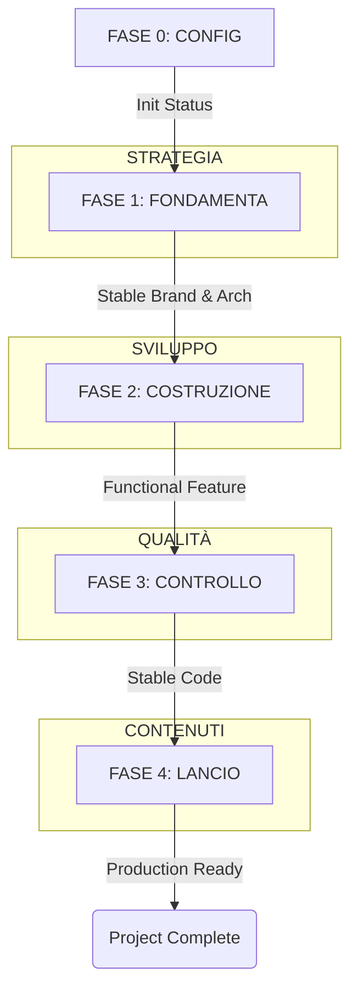

# The Golden Path — Guide to Structured AI Workflow

This document explains the "engine" of the AI Kit Base and how to navigate projects using specialized agents and structured phases.

## 🗺️ The 5 Phases (Timeline)

## 🤖 Agent Specialization & Handoffs

The AI Kit is designed for a **Multi-Agent Relay**. Each phase is an opportunity to switch to the most efficient tool for the job.

| Phase | Recommended Agent Role | Why Switch? |
| :--- | :--- | :--- |
| **F1: STRATEGIA** | Architect / Strategist | Better at broad vision and UX theory. |
| **F2: SVILUPPO** | Builder / Terminal Coder | Faster at multi-file edits and terminal tasks. |
| **F3: QUALITÀ** | Auditor / Quality Agent | Fresh perspective on security and performance. |
| **F4: LANCIO** | Content / SEO Specialist | Specialized in copywriting; saves coding tokens. |

## ⚙️ How the Engine Works (Mind Map)

1.  **Initial Prompt**: User points the agent to the `PROMPT.md` entry point.
2.  **Master Rules**: The agent loads `MASTER-RULES.md`, establishing the "Agnostic Awareness".
3.  **Status Reading**: The agent reads `[ID]-STATUS.md` to find its location on the **Golden Path**.
4.  **Skill Loading**: Based on the `CURRENT_PHASE`, the agent loads the relevant skills.
5.  **Initialization Statement**: The agent confirms its status: *"Skill: X, Phase: Y, Category: Z"*.
6.  **Handoff / Drift**: If the user's request changes the category, the agent triggers **Drift Detection** and suggests a transition.
7.  **Historification**: Every major decision is logged in `[ID]-HISTORY.md` to ensure session continuity.

---
*Follow the Golden Path. Don't jump. Build to last.*
