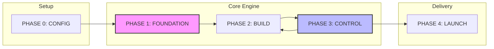

# The 3-Mode Engine — Guide to AI Kit V2

This document explains the AI Kit Base V2 engine and how to navigate projects using specialized modes and structured phases.

## 🗺️ Operation Modes

The Kit adapts its logic based on what you are doing:

- **🏗️ BUILD**: Creating new software. Uses the full 5-phase Golden Path.
- **🔍 AUDIT**: Analyzing existing software. Focuses on understanding and mapping.
- **📚 DOCUMENT**: Writing manuals and API docs. Skips straight to content generation.

## 🗺️ The Phases (Execution Flow)



## 🤖 Mode-Specific Routing

| Mode | Primary Focus | Key Outputs |
| :--- | :--- | :--- |
| **BUILD** | New implementation | Clean code, Design System, Functional App. |
| **AUDIT** | Analysis & Improvement | 6 Reports (Map, Flow, Quality, Security, Deps, Plan) → Refactor. |
| **DOCUMENT** | Communication | README, API Reference, User Guide, SEO Meta. |

## ⚙️ How the Engine Works

1.  **Initial Interview**: The agent verifies prerequisites (Git/Env) and asks for the `OPERATION_MODE`.
2.  **Status Check**: The agent reads `[ID]-STATUS.md` to load the current `OPERATION_MODE` and `CURRENT_PHASE`.
3.  **Skill Loading**: The agent loads only the skills required for the current mode/phase combo.
4.  **Zero-Step Statement**: The agent confirms: *"Skills: [X], Mode: [MODE], Phase: [PHASE]"*.
5.  **Autonomous Loop**: The agent builds or audits until a stable milestone is reached.
6.  **Milestone Gate**: A quality audit (Checkpoint) is mandatory before moving to the next phase.

### AUDIT Mode — Full Flow

```
core-audit (6 Reports) → AUDIT-PLAN.md approved → core-refactor (fix by fix) → core-quality (checkpoint) → core-documentation
```

---
*One Kit. Three Modes. Infinite Professional Workflows.*
